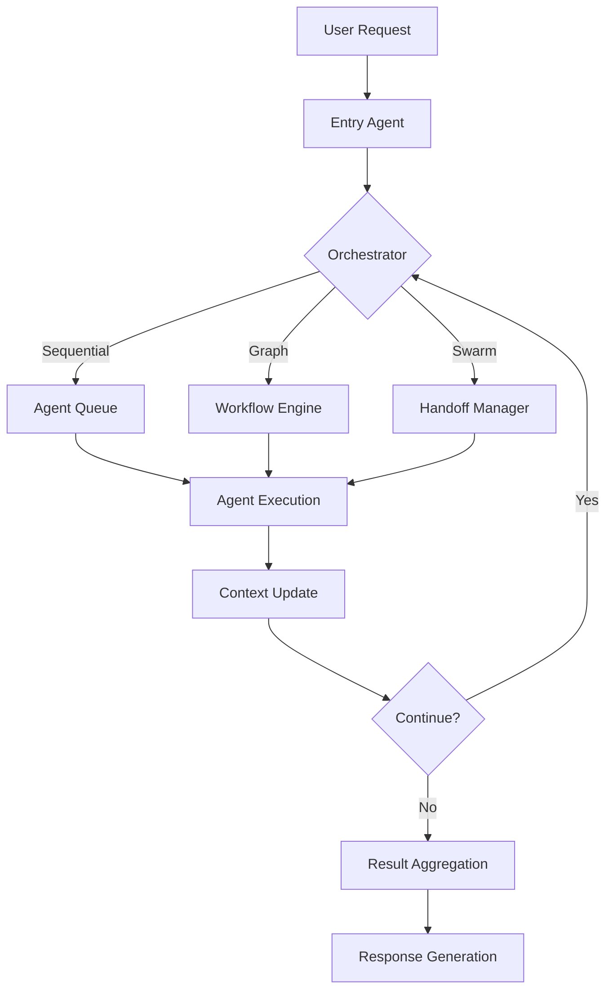

# Product Requirements Document (PRD)
# AutoGen Agent-to-Agent (A2A) Communication System

## Document Information
- **Version**: 1.0
- **Date**: August 10, 2025
- **Author**: Product Development Team
- **Status**: Draft

---

## Executive Summary

This PRD outlines the development of a comprehensive multi-agent system built on Microsoft AutoGen framework, featuring robust agent-to-agent (A2A) communication capabilities. The system will enable autonomous agents to collaborate, coordinate, and execute complex tasks through intelligent inter-agent communication patterns.

### Key Value Propositions
- **Scalable Multi-Agent Architecture**: Support for distributed agent networks with dynamic scaling
- **Intelligent A2A Communication**: Context-aware message routing and handoff mechanisms
- **Flexible Orchestration**: Multiple coordination patterns (Sequential, Round-Robin, Graph-based, Swarm)
- **Enterprise-Ready**: Production-grade reliability with monitoring and observability

---

## Market Context & Problem Statement

### Current Market Challenges
1. **Fragmented AI Agent Solutions**: Existing systems lack standardized inter-agent communication protocols
2. **Limited Scalability**: Most solutions cannot handle complex multi-agent workflows at enterprise scale
3. **Poor Coordination**: Agents often work in isolation without effective collaboration mechanisms
4. **Complex Integration**: Difficulty in integrating diverse AI models and services

### Target Opportunities
- **Enterprise Automation**: Large-scale business process automation requiring multiple specialized agents
- **Research & Development**: Complex problem-solving requiring collaborative AI systems
- **Customer Service**: Multi-tier support systems with agent handoffs
- **Content Creation**: Collaborative content generation workflows

---

## Product Vision & Objectives

### Vision Statement
To create the industry's most advanced multi-agent communication platform that enables seamless collaboration between AI agents, empowering organizations to solve complex problems through distributed AI intelligence.

### Primary Objectives
1. **Enable Sophisticated A2A Communication**: Implement multiple communication patterns for agent interaction
2. **Ensure System Reliability**: Achieve 99.9% uptime with robust error handling and recovery
3. **Provide Developer Experience**: Intuitive APIs and tools for agent development and deployment
4. **Support Multiple Use Cases**: Flexible architecture supporting diverse application domains

---

## User Personas & Use Cases

### Primary Personas

#### 1. Enterprise AI Developer
- **Background**: Senior software engineer building AI-powered business applications
- **Goals**: Rapid development of multi-agent systems with minimal complexity
- **Pain Points**: Complex integration requirements, lack of standardized patterns

#### 2. Research Scientist
- **Background**: AI/ML researcher exploring multi-agent collaboration
- **Goals**: Experiment with novel agent communication patterns and behaviors
- **Pain Points**: Limited flexibility in existing frameworks, poor observability

#### 3. System Administrator
- **Background**: IT professional managing AI infrastructure
- **Goals**: Monitor, maintain, and scale agent deployments
- **Pain Points**: Lack of monitoring tools, difficult troubleshooting

### Key Use Cases

#### UC1: Collaborative Code Development
**Scenario**: Multiple specialized agents (architect, coder, reviewer, tester) collaborate to develop software
- **Agents**: Architecture Agent, Coding Agent, Review Agent, Testing Agent, Documentation Agent
- **Flow**: Sequential workflow with conditional branching and feedback loops
- **A2A Communication**: Structured handoffs with context preservation

#### UC2: Customer Support Escalation
**Scenario**: Multi-tier customer support with agent specialization
- **Agents**: Intake Agent, Technical Support Agent, Billing Agent, Manager Agent
- **Flow**: Dynamic routing based on issue classification
- **A2A Communication**: Context-aware handoffs with customer history

#### UC3: Research Analysis Pipeline
**Scenario**: Collaborative research with data collection, analysis, and reporting
- **Agents**: Data Collector, Analyst, Statistician, Report Generator
- **Flow**: Parallel processing with synchronization points
- **A2A Communication**: Data sharing and result aggregation

#### UC4: Content Creation Workflow
**Scenario**: Multi-stage content creation with review and optimization
- **Agents**: Content Planner, Writer, Editor, SEO Optimizer, Publisher
- **Flow**: Linear pipeline with quality gates
- **A2A Communication**: Content handoffs with metadata preservation

---

## Functional Requirements

### Core Platform Features

#### F1: Agent Management System
- **F1.1**: Agent registration and discovery service
- **F1.2**: Agent lifecycle management (create, start, stop, destroy)
- **F1.3**: Agent capability advertisement and matching
- **F1.4**: Agent health monitoring and heartbeat tracking
- **F1.5**: Dynamic agent scaling based on workload

#### F2: Communication Infrastructure
- **F2.1**: Message routing and delivery guarantees
- **F2.2**: Multiple communication patterns:
  - Direct agent-to-agent messaging
  - Broadcast messaging to agent groups
  - Publish-subscribe messaging patterns
  - Request-response with timeout handling
- **F2.3**: Message serialization and deserialization
- **F2.4**: Message persistence and replay capabilities
- **F2.5**: Message ordering and causality preservation

#### F3: Workflow Orchestration
- **F3.1**: Sequential workflows with linear progression
- **F3.2**: Round-robin agent coordination
- **F3.3**: Graph-based workflows with conditional branching
- **F3.4**: Swarm coordination with autonomous handoffs
- **F3.5**: Parallel execution with synchronization
- **F3.6**: Workflow state management and persistence

#### F4: Context Management
- **F4.1**: Shared context repositories for agent collaboration
- **F4.2**: Context versioning and conflict resolution
- **F4.3**: Context scoping and access control
- **F4.4**: Context inheritance in agent handoffs
- **F4.5**: Context compression and optimization

### Agent-to-Agent Communication Features

#### F5: Handoff Mechanisms
- **F5.1**: Structured handoff messages with metadata
- **F5.2**: Conditional handoffs based on agent state
- **F5.3**: Multi-target handoffs for parallel processing
- **F5.4**: Handoff rollback and error recovery
- **F5.5**: Handoff auditing and tracking

#### F6: Message Types and Protocols
- **F6.1**: Standard message types:
  - Task assignment messages
  - Status update messages
  - Data sharing messages
  - Control flow messages
  - Error notification messages
- **F6.2**: Custom message type registration
- **F6.3**: Message validation and schema enforcement
- **F6.4**: Message compression for large payloads

#### F7: Coordination Patterns
- **F7.1**: Leader-follower coordination
- **F7.2**: Peer-to-peer collaboration
- **F7.3**: Hierarchical agent structures
- **F7.4**: Democratic decision-making processes
- **F7.5**: Auction-based task allocation

### Integration Features

#### F8: Model Integration
- **F8.1**: Support for multiple LLM providers:
  - OpenAI GPT models
  - Azure OpenAI Service
  - Anthropic Claude
  - Local models (Ollama, etc.)
- **F8.2**: Model switching and failover
- **F8.3**: Model performance optimization
- **F8.4**: Custom model adapters

#### F9: Tool Integration
- **F9.1**: Function calling capabilities
- **F9.2**: External service integration
- **F9.3**: Database connectivity
- **F9.4**: File system operations
- **F9.5**: Web browsing and API calls

#### F10: Runtime Environments
- **F10.1**: Local runtime for development
- **F10.2**: Distributed runtime for production
- **F10.3**: Cloud-native deployment options
- **F10.4**: Container orchestration support

---

## Non-Functional Requirements

### Performance Requirements
- **P1**: Message latency < 100ms for 95% of communications
- **P2**: System throughput > 10,000 messages/second
- **P3**: Agent startup time < 5 seconds
- **P4**: Workflow completion time within expected SLA ranges

### Scalability Requirements
- **S1**: Support for 1,000+ concurrent agents
- **S2**: Horizontal scaling with linear performance characteristics
- **S3**: Dynamic resource allocation based on demand
- **S4**: Geographic distribution with multi-region support

### Reliability Requirements
- **R1**: System availability of 99.9% uptime
- **R2**: Automatic failure detection and recovery
- **R3**: Message delivery guarantees (at-least-once, exactly-once)
- **R4**: Data persistence and backup capabilities

### Security Requirements
- **SEC1**: End-to-end encryption for inter-agent communication
- **SEC2**: Agent authentication and authorization
- **SEC3**: Audit logging for all system activities
- **SEC4**: Secure secret management for API keys and credentials

### Usability Requirements
- **U1**: Intuitive developer APIs with comprehensive documentation
- **U2**: Visual workflow designer for non-technical users
- **U3**: Real-time monitoring dashboards
- **U4**: Comprehensive error messages and debugging tools

---

## Technical Architecture

### System Architecture Overview

```
┌─────────────────────────────────────────────────────────────┐
│                    AutoGen A2A Platform                     │
├─────────────────────────────────────────────────────────────┤
│  Agent Layer                                                │
│  ┌─────────────┐ ┌─────────────┐ ┌─────────────┐            │
│  │ Agent A     │ │ Agent B     │ │ Agent C     │   ...      │
│  │ (Assistant) │ │ (Specialist)│ │ (Manager)   │            │
│  └─────────────┘ └─────────────┘ └─────────────┘            │
├─────────────────────────────────────────────────────────────┤
│  Communication Layer                                         │
│  ┌─────────────────────────────────────────────────────────┐ │
│  │ Message Router │ Handoff Manager │ Context Manager     │ │
│  └─────────────────────────────────────────────────────────┘ │
├─────────────────────────────────────────────────────────────┤
│  Orchestration Layer                                         │
│  ┌─────────────────────────────────────────────────────────┐ │
│  │ Sequential │ RoundRobin │ GraphFlow │ Swarm │ Custom   │ │
│  └─────────────────────────────────────────────────────────┘ │
├─────────────────────────────────────────────────────────────┤
│  Runtime Layer                                               │
│  ┌─────────────────────────────────────────────────────────┐ │
│  │ Agent Runtime │ Message Bus │ State Management         │ │
│  └─────────────────────────────────────────────────────────┘ │
├─────────────────────────────────────────────────────────────┤
│  Infrastructure Layer                                        │
│  ┌─────────────────────────────────────────────────────────┐ │
│  │ Model Clients │ Storage │ Monitoring │ Security        │ │
│  └─────────────────────────────────────────────────────────┘ │
└─────────────────────────────────────────────────────────────┘
```

### Component Details

#### Agent Layer
- **Assistant Agents**: General-purpose conversational agents
- **Specialist Agents**: Domain-specific agents with specialized capabilities
- **Manager Agents**: Coordination and orchestration agents
- **Tool Agents**: Agents with specific tool integration capabilities

#### Communication Layer
- **Message Router**: Intelligent routing of messages between agents
- **Handoff Manager**: Manages agent handoffs and context transfer
- **Context Manager**: Maintains shared state and conversation history

#### Orchestration Layer
- **Sequential Orchestrator**: Linear workflow execution
- **Round-Robin Orchestrator**: Cyclic agent coordination
- **Graph-Flow Orchestrator**: Complex workflow with conditional logic
- **Swarm Orchestrator**: Autonomous agent coordination
- **Custom Orchestrators**: Pluggable orchestration patterns

### Data Flow Architecture



---

## API Design

### Core APIs

#### Agent Management API
```python
# Agent Registration
async def register_agent(agent_config: AgentConfig) -> AgentId
async def unregister_agent(agent_id: AgentId) -> bool
async def list_agents(filters: Optional[Dict] = None) -> List[AgentInfo]

# Agent Lifecycle
async def start_agent(agent_id: AgentId) -> bool
async def stop_agent(agent_id: AgentId) -> bool
async def restart_agent(agent_id: AgentId) -> bool
async def get_agent_status(agent_id: AgentId) -> AgentStatus
```

#### Communication API
```python
# Direct Messaging
async def send_message(
    sender_id: AgentId,
    receiver_id: AgentId,
    message: BaseChatMessage
) -> MessageResult

# Broadcast Messaging
async def broadcast_message(
    sender_id: AgentId,
    group_id: GroupId,
    message: BaseChatMessage
) -> List[MessageResult]

# Handoff Operations
async def handoff_to_agent(
    current_agent: AgentId,
    target_agent: AgentId,
    context: HandoffContext
) -> HandoffResult
```

#### Workflow API
```python
# Workflow Management
async def create_workflow(workflow_config: WorkflowConfig) -> WorkflowId
async def start_workflow(workflow_id: WorkflowId, initial_task: str) -> ExecutionId
async def pause_workflow(execution_id: ExecutionId) -> bool
async def resume_workflow(execution_id: ExecutionId) -> bool
async def stop_workflow(execution_id: ExecutionId) -> bool

# Workflow Monitoring
async def get_workflow_status(execution_id: ExecutionId) -> WorkflowStatus
async def get_workflow_history(execution_id: ExecutionId) -> List[WorkflowEvent]
```

### Message Schema

#### Base Message Structure
```python
class BaseChatMessage:
    id: str
    timestamp: datetime
    source: str
    content: Union[str, List[str], Dict]
    metadata: Optional[Dict] = None
    conversation_id: Optional[str] = None
```

#### Handoff Message
```python
class HandoffMessage(BaseChatMessage):
    target: str
    context: HandoffContext
    reason: Optional[str] = None
    priority: Priority = Priority.NORMAL
```

#### Task Message
```python
class TaskMessage(BaseChatMessage):
    task_id: str
    task_type: TaskType
    parameters: Dict
    deadline: Optional[datetime] = None
    dependencies: List[str] = []
```

---

## User Interface Design

### Developer Console
- **Agent Management Dashboard**: Visual agent status and management
- **Workflow Designer**: Drag-and-drop workflow creation
- **Message Monitor**: Real-time message flow visualization
- **Performance Analytics**: System metrics and optimization insights

### Monitoring Dashboard
- **System Health**: Overall system status and alerts
- **Agent Performance**: Individual agent metrics and health
- **Communication Patterns**: Message flow analysis and optimization
- **Resource Utilization**: Infrastructure usage and scaling recommendations

### API Documentation Portal
- **Interactive API Explorer**: Test APIs directly from documentation
- **Code Examples**: Language-specific implementation examples
- **Best Practices Guide**: Recommended patterns and practices
- **Troubleshooting Guide**: Common issues and solutions

---

## Development Phases

### Phase 1: Foundation (Months 1-3)
**Objective**: Establish core platform infrastructure

**Deliverables**:
- Agent runtime and lifecycle management
- Basic message routing infrastructure
- Sequential and round-robin orchestration
- Local development environment
- Core APIs and SDK

**Success Criteria**:
- Support for 100 concurrent agents
- Basic A2A communication working
- Developer SDK available

### Phase 2: Advanced Communication (Months 4-6)
**Objective**: Implement sophisticated communication patterns

**Deliverables**:
- Handoff mechanisms and context management
- Graph-based workflow orchestration
- Swarm coordination patterns
- Message persistence and replay
- Enhanced monitoring and debugging tools

**Success Criteria**:
- Complex workflows executable
- Context preservation across handoffs
- Production-ready monitoring

### Phase 3: Scale & Reliability (Months 7-9)
**Objective**: Production-grade scalability and reliability

**Deliverables**:
- Distributed runtime implementation
- Horizontal scaling capabilities
- High availability and fault tolerance
- Security implementation
- Performance optimization

**Success Criteria**:
- Support for 1000+ concurrent agents
- 99.9% uptime achieved
- Security audit passed

### Phase 4: Enterprise Features (Months 10-12)
**Objective**: Enterprise-ready features and integrations

**Deliverables**:
- Multi-tenancy support
- Advanced analytics and reporting
- Enterprise integrations
- Visual workflow designer
- Comprehensive documentation

**Success Criteria**:
- Enterprise customer deployment
- Full feature completeness
- Customer satisfaction > 4.5/5

---

## Success Metrics & KPIs

### Technical Metrics
- **System Performance**:
  - Message latency: Target < 100ms (P95)
  - Throughput: Target > 10,000 msg/sec
  - System uptime: Target > 99.9%
  - Agent startup time: Target < 5 seconds

- **Scalability Metrics**:
  - Concurrent agents supported: Target > 1,000
  - Workflow complexity: Target > 100 nodes
  - Message volume: Target > 1M messages/day

### Business Metrics
- **Adoption Metrics**:
  - Developer sign-ups: Target 1,000+ in Year 1
  - Active workloads: Target 100+ production deployments
  - API usage: Target 10M+ API calls/month

- **Quality Metrics**:
  - Customer satisfaction: Target > 4.5/5
  - Bug report rate: Target < 1 per 1000 users
  - Support ticket resolution: Target < 24 hours

### User Experience Metrics
- **Developer Experience**:
  - Time to first working agent: Target < 30 minutes
  - API documentation rating: Target > 4.0/5
  - SDK adoption rate: Target > 60%

- **Operational Metrics**:
  - Mean time to detection (MTTD): Target < 5 minutes
  - Mean time to recovery (MTTR): Target < 30 minutes
  - False positive rate: Target < 5%

---

## Risk Assessment & Mitigation

### Technical Risks

#### High Priority Risks

**Risk 1: Message Ordering and Consistency**
- **Impact**: High - Could lead to workflow failures and incorrect results
- **Probability**: Medium
- **Mitigation**: 
  - Implement vector clocks for message ordering
  - Use distributed consensus for critical operations
  - Extensive testing with chaos engineering

**Risk 2: Agent Communication Deadlocks**
- **Impact**: High - Could cause system-wide failures
- **Probability**: Medium
- **Mitigation**:
  - Implement timeout mechanisms for all communications
  - Use deadlock detection algorithms
  - Circuit breaker patterns for failing agents

**Risk 3: Context Synchronization Issues**
- **Impact**: Medium - Could lead to inconsistent agent behavior
- **Probability**: High
- **Mitigation**:
  - Implement eventual consistency model
  - Version control for context updates
  - Conflict resolution strategies

#### Medium Priority Risks

**Risk 4: Model Provider Rate Limiting**
- **Impact**: Medium - Could slow down agent execution
- **Probability**: High
- **Mitigation**:
  - Implement request throttling and queuing
  - Support multiple model providers for failover
  - Caching strategies for repeated requests

**Risk 5: Memory Leaks in Long-Running Workflows**
- **Impact**: Medium - Could cause system instability
- **Probability**: Medium
- **Mitigation**:
  - Implement garbage collection for inactive contexts
  - Memory monitoring and alerting
  - Workflow checkpointing and restart capabilities

### Business Risks

**Risk 6: Competition from Established Players**
- **Impact**: High - Could limit market adoption
- **Probability**: High
- **Mitigation**:
  - Focus on superior developer experience
  - Build strong community and ecosystem
  - Rapid feature development and innovation

**Risk 7: Changing AI Model Landscape**
- **Impact**: Medium - Could require significant architecture changes
- **Probability**: Medium
- **Mitigation**:
  - Maintain model-agnostic architecture
  - Stay current with industry trends
  - Build strong partnerships with model providers

---

## Dependencies & Assumptions

### External Dependencies
- **Microsoft AutoGen Framework**: Core foundation for agent development
- **Cloud Infrastructure**: AWS/Azure/GCP for distributed deployment
- **Model Providers**: OpenAI, Anthropic, Azure OpenAI for LLM capabilities
- **Message Queue Systems**: Apache Kafka, Redis, or cloud-native solutions
- **Database Systems**: PostgreSQL, Redis for state persistence
- **Monitoring Tools**: Prometheus, Grafana for observability

### Key Assumptions
- AutoGen framework continues active development and support
- Model provider APIs remain stable and accessible
- Cloud infrastructure maintains high availability
- Developer community adopts multi-agent paradigm
- Enterprise demand for agent orchestration grows
- Regulatory environment remains favorable for AI deployment

### Technical Assumptions
- Python and TypeScript remain primary development languages
- Container-based deployment becomes standard
- GraphQL APIs provide adequate performance
- WebSocket connections support real-time communication needs
- Standard security protocols (OAuth2, JWT) meet requirements

---

## Appendices

### Appendix A: Competitive Analysis

#### Direct Competitors
1. **LangChain Multi-Agent**: Limited orchestration capabilities
2. **CrewAI**: Focus on role-based agents, less flexible communication
3. **MetaGPT**: Specialized for software development use cases

#### Competitive Advantages
- Built on proven Microsoft AutoGen foundation
- Superior A2A communication patterns
- Enterprise-grade scalability and reliability
- Comprehensive developer tools and documentation

### Appendix B: Technical Reference Architecture

#### Message Flow Diagram
```
[Agent A] --message--> [Message Router] --route--> [Agent B]
                           |
                           v
                    [Context Manager] --update--> [Shared Context]
                           |
                           v
                    [Audit Logger] --log--> [Audit Store]
```

#### State Management Model
- **Agent State**: Individual agent status and configuration
- **Workflow State**: Current execution state and history
- **Context State**: Shared information and conversation history
- **System State**: Infrastructure health and performance metrics

### Appendix C: Sample Implementation

#### Basic Agent Setup
```python
from autogen_agentchat.agents import AssistantAgent
from autogen_agentchat.teams import Swarm
from autogen_agentchat.conditions import MaxMessageTermination
from autogen_ext.models.openai import OpenAIChatCompletionClient

# Initialize model client
model_client = OpenAIChatCompletionClient(model="gpt-4o")

# Create specialized agents
architect = AssistantAgent(
    "architect",
    model_client=model_client,
    system_message="You are a software architect. Design system architecture.",
    handoffs=["coder"]
)

coder = AssistantAgent(
    "coder", 
    model_client=model_client,
    system_message="You write code based on architectural designs.",
    handoffs=["reviewer"]
)

reviewer = AssistantAgent(
    "reviewer",
    model_client=model_client,
    system_message="You review code for quality and best practices.",
    handoffs=["architect", "coder"]
)

# Create swarm team
team = Swarm(
    [architect, coder, reviewer],
    termination_condition=MaxMessageTermination(10)
)

# Execute workflow
result = await team.run(task="Build a REST API for user management")
```

### Appendix D: Glossary

**Agent**: An autonomous AI entity capable of performing tasks and communicating with other agents

**A2A Communication**: Agent-to-Agent communication patterns and protocols

**Handoff**: The process of transferring control and context from one agent to another

**Context**: Shared information and state maintained across agent interactions

**Orchestration**: The coordination and management of multiple agents in a workflow

**Runtime**: The execution environment that manages agent lifecycle and communication

**Workflow**: A defined sequence or pattern of agent interactions to accomplish a goal

---

## Document Approval

| Role | Name | Signature | Date |
|------|------|-----------|------|
| Product Manager | [Name] | [Signature] | [Date] |
| Engineering Lead | [Name] | [Signature] | [Date] |
| Architecture Lead | [Name] | [Signature] | [Date] |
| QA Lead | [Name] | [Signature] | [Date] |

---

*This document is confidential and proprietary. Distribution is restricted to authorized personnel only.*
